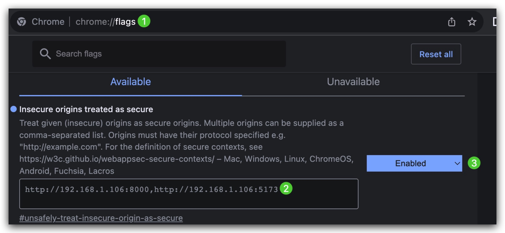

# Talk

Talk is a single-page application crafted to converse with AI using voice, replicating the user experience akin to a
native app.

**[Demo](https://talk.proxoar.com)**  (No Signup. No Login. Simply start conversing. For an optimal
experience, open in Chrome)


<div align="center">
View on 
<a  href="https://www.figma.com/file/4Uhzr87YVN1KR5ayz7WDYm/Talk?type=whiteboard&t=OGwMZMSKsWZIwG0T-1" target="_blank">
Figma
</a>
</div>

# Highlighted Features

- Focus on voice-driven dialogues
- Broad range of service providers to choose from: ChatGPT, Elevenlabs, Google Text-toSpeech, Whisper and Google
  Speech-to-Text
- Modern and stylish user interface
- Unified, standalone binary

# How to use

## 1. Prepare a `talk.yaml` file.

Here is a [simple example](example/talk.simple.example.yaml) utilising ChatGPT, Whisper and
Elevenlabs:

```yaml
speech-to-text:
  whisper: open-ai-01

llm:
  chat-gpt: open-ai-01

text-to-speech:
  elevenlabs: elevenlabs-01

# provide your confidential information below.
creds:
  open-ai-01: "sk-2dwY1IAeEysbnDNuAKJDXofX1IAeEysbnDNuAKJDXofXF5"
  elevenlabs-01: "711sfpb9kk15sds8m4czuk5rozvp43a4"
```

Looking to utilise Google Text-to-Speech and Google Speech-to-Text? Not to worry, we have that covered. Please refer
to [talk.google.example.yaml](example/talk.google.example.yaml) for more information

The comprehensive example: [talk.full.example.yaml](example/talk.full.example.yaml)

## 2. Start the application

### Docker

```shell
docker run -it -v ./talk.yaml:/etc/talk/talk.yaml -p 8000:8000 proxoar/talk
```

### Terraform

Refer to [terraform](example/terraform). The same applies to Kubernetes.

### From scratch

```shell
# clone projects
mkdir talk-projects && cd talk-projects
git clone https://github.com/proxoar/talk.git
git clone https://github.com/proxoar/talk-web.git

# build web with yarn; currently using node v20.3.0 
cd talk-web && ./script/build-and-copy-to-backend.sh 

cd ../talk && go build cmd/talk/talk.go

# run
./talk --config ./talk.yaml
# or simply `./talk` as it automatically locates talk.yaml in `/etc/talk/` and `./talk.yaml`
./talk
```

# Advanced usage

### Proxy

We honour `HTTP_PROXY` and `HTTPS_PROXY`. Given that all communication between the Talk server and providers occurs via
HTTPS, simply employ `HTTPS_PROXY`.

```shell
docker run -it -v ./talk.yaml:/etc/talk/talk.yaml \ 
-e HTTPS_PROXY=http://192.168.1.105:7890 \ 
-p 8000:8000 \ 
proxoar/talk
```

### HTTPS

#### Generate self-signed cert on the fly

Example: [talk.tls.self.signed.example.yaml](example/talk.tls.self.signed.example.yaml)

```yaml
server:
  tls:
    self-signed: true
```

This is handy if you're indifferent to a domain and unconcerned about security, simply desiring to enable
microphone access on browsers.

##### Provide you own TLS

Example: [talk.tls.provided.example.yaml](example/talk.tls.provided.example.yaml)

##### Auto TLS

This configuration example facilitates automatic certificate acquisition from
LetsEncrypt: [talk.tls.auto.example.yaml](example/talk.tls.auto.example.yaml)

Requirements: You should have your personal VPS and domain.

# Troubleshooting

### Why can't I start the recording?

Web browsers safeguard your microphone from being accessed by non-HTTPS websites for security reasons, with the
exceptions being `localhost` and `127.0.0.1`.

Remedies:

* Enable [HTTPS](#https). Particularly, you can [Generate self-signed cert on the fly](#generate-self-signed-cert-on-the-fly) in a mere second.
* Run Talk through a reverse proxy like Nginx and set up TLS within this service.
* In Chrome, go to `chrome://flags/`, find `Insecure origins treated as secure`, and enable it:
  <br>
  
  <br>

# Browser compatibility

|            | [Arc](https://arc.net/) | Chrome | FireFox | Edge | Safari |
|:----------:|:-----------------------:|:------:|:-------:|:----:|:------:|
| Microphone |            ✅            |   ✅    |    ✅    |  ❌   |   ❌    |
|     UI     |            ✅            |   ✅    |    ✅    |  ✅   |   ❌    |

# Q&A

**Q: Why not use TypeScript for both the frontend and backend development?**

A:

* When I embarked on this project, I was largely inspired by [Hugh](https://github.com/IgnoranceAI/hugh), a project
  primarily coded in Python, supplemented with HTML and a touch of JavaScript. To broaden the horizons of text-to-speech
  providers, I revamped the backend logic using Go, transforming it into a Go-based project.
* Crafting backend logic with Go feels incredibly intuitive—it distills everything down to a single binary.
* Moreover, my skills in frontend development were somewhat rudimentary at that time.

**Q: Will a mobile browser-friendly version be made available?**

A: Streamlining the website for mobile usage would be a time-intensive endeavour and, given my current time constraints,
it isn't the primary concern. As it stands, the site performs optimally on desktop browsers based on the Chromium
Engine, with certain limitations on browsers such as Safari.

# Roadmap

- [x] Google TTS
- [x] Google STT
- [x] OpenAI Whisper STT
- [x] Setting language, speed, stability, etc
- [x] Choose voice
- [x] Docker image
- [x] Server Side Events(SSE)
- [ ] More LLMs other than ChatGPT
- [ ] Download and import text history
- [x] Download chat MP3
- [ ] Prompt template

# Contributing

We're in the midst of a dynamic development stage for this project and warmly invite new contributors.

Doc for contributing will be ready soon.

# Credits

### Front-end

* [React](https://github.com/facebook/react): The library for web and native user interfaces
* [vite](https://github.com/vitejs/vite): Next generation frontend tooling. It's fast!
* [valtio](https://github.com/pmndrs/valtio): Valtio makes proxy-state simple for React and Vanilla
* [wavesurfer.js](https://github.com/katspaugh/wavesurfer.js): Audio waveform player
* [granim.js](https://github.com/sarcadass/granim.js): Create fluid and interactive gradient animations with this small
  javascript library.

### Back-end

* This project draws inspiration from [Hugh](https://github.com/IgnoranceAI/hugh), a remarkable tool that enables
  seamless communication with AI using minimal code.
* [go-openai](https://github.com/sashabaranov/go-openai): OpenAI ChatGPT, GPT-3, GPT-4, DALL·E, Whisper API wrapper for
  Go.
* [echo](https://github.com/labstack/echo): High performance, minimalist Go web framework
* [elevenlabs-go](https://github.com/haguro/elevenlabs-go): A Go API client library for the ElevenLabs speech synthesis
* [r3labs/sse](https://github.com/r3labs/sse/): Server Sent Events server and client for Golang
  platform.

### UI

* [wikiart.org](https://www.wikiart.org): Wikiart is a great place to find art online. Most wallpapers of Talk come
  from WikiArt.org
* [Arc](https://arc.net/): Arc is the Chrome replacement I’ve been waiting
  for -- [THE VERGE](https://www.theverge.com/23462235/arc-web-browser-review)
* [grainy-gradients](https://github.com/cjimmy/grainy-gradients): Thanks to [cjimmy](https://github.com/cjimmy/) for his
  amazing [tutorial](https://css-tricks.com/grainy-gradients/) on noise and gradient background
* [Signal-Desktop](https://github.com/signalapp/Signal-Desktop)
  and [Signal-iOS](https://github.com/signalapp/Signal-iOS): Private messengers. Much of the inspiration for the UI
  comes from Signal.

We would also like to thank all other open-source projects and communities not listed here for their valuable
contributions to our project.
